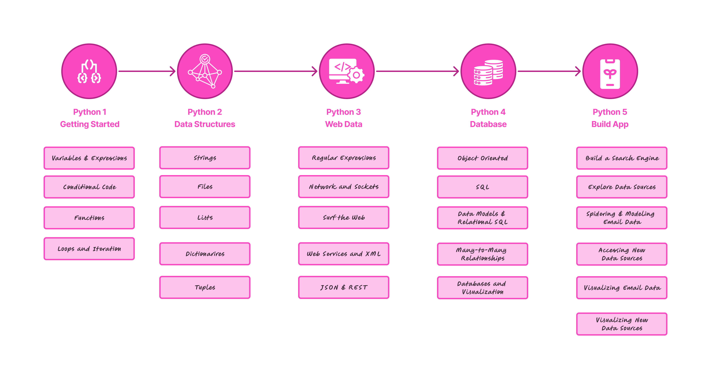

<h1 align="center">Python for Everybody Specialization 🚀</h1>

  
  
  
  

Welcome to the ultimate resource for mastering Python! This repository contains the complete source code, practical exercises, and solutions for the **"Python for Everybody" Specialization** by the University of Michigan on Coursera.

Whether you're a beginner or looking to strengthen your Python skills, this repo is designed to help you learn by doing, with well-organized code and real-world assignments.

**Specialization Link:** [Python for Everybody Specialization on Coursera](https://www.coursera.org/specializations/python)

## 📚 Courses Included

1. [**Programming for Everybody (Getting Started with Python)**](https://www.coursera.org/learn/python?specialization=python)
2. [**Python Data Structures**](https://www.coursera.org/learn/python-data?specialization=python)
3. [**Using Python to Access Web Data**](https://www.coursera.org/learn/python-network-data?specialization=python)
4. [**Using Databases with Python**](https://www.coursera.org/learn/python-databases?specialization=python)
5. [**Capstone: Retrieving, Processing, and Visualizing Data with Python**](https://www.coursera.org/learn/python-data-visualization?specialization=python)

## 📋 Course Overview & Learning Path

## 🤝 Contributing

Contributions are welcome! If you have improvements, additional solutions, or suggestions, feel free to open an issue or submit a pull request.

## 🙏 Credits

- **University of Michigan** for the [Python for Everybody Specialization](https://www.coursera.org/specializations/python)
- [Dr. Charles Russell Severance (Dr. Chuck)](https://www.coursera.org/instructor/drchuck) for his outstanding teaching
- [Coursera](https://www.coursera.org/) for the great platform

---

<b>Happy learning and coding! 🎉</b>

